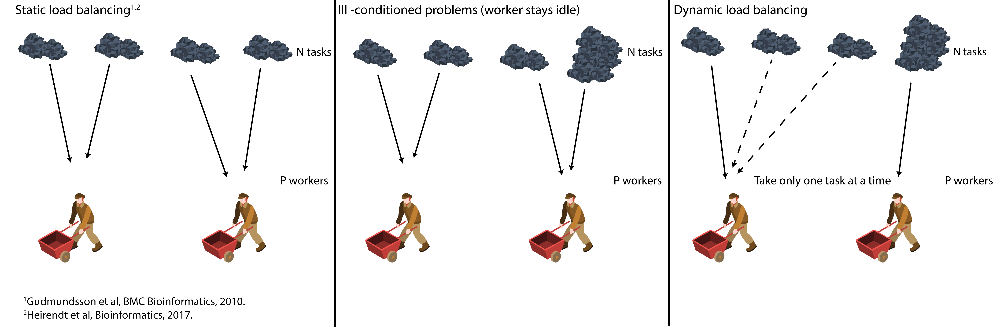

This repository provides the code and result figures with the paper:

[Dynamic load balancing enables large-scale flux variability analysis.](https://www.biorxiv.org/content/early/2018/10/11/440701)

Contact: [Marouen Ben Guebila](mailto:marouen.b.guebila@gmail.com)

### Usage
Please refer to the [UserGuide](UserGuide.md) for veryfastFVA (VFFVA) usage.

Add the project folder to your MATLAB path and save it.

For the comparison with fastFVA (FFVA), you can install FFVA [here](http://wwwen.uni.lu/lcsb/research/mol_systems_physiology/fastfva).

### Motivation
FVA³ is the workhorse of metabolic modeling. It allows to characterize the boundaries of the solution space of a metabolic model and delineates the bounds
for reaction rates.

FFVA¹ brought considerable speed up over FVA through the use C over MATLAB, and the reuse of the same LP object which allows to avoid solving the optimization problem from
scratch for every reaction. Although, with the increase of the size of metabolic models, FFVA is run usually in parallel. 

The parallel setting for the common FVA implementations1,2 relies on dividing the 2n tasks (one maximization and one minimization for the n reactions) among the p workers equally.
Such as each worker gets 2n/p reactions to process. This is called **static load balancing** and would be the optimal startegy if each of the n reactions is solved in equal times (left figure).

Nevertheless, in most metabolic models there are several ill-conditioned reactions that require longer solution time thereby slowing the worker processing them which
impacts the overall process, as the workers have to synchronize at the end to reduce the results (middle figure).

One approach would be to estimate *a priori* the solution time of each reaction and distribute to each worker 2n/p reactions of equal solution time. But, estimating the solution
time of a reaction *a priori* could be a challenging task.

VFFVA performs **dynamic load blancing**. In runtime, each worker gets a small chunk of reactions to process and once finished, gets another one and so on (right figure). This setting allows i)
fast workers to process more reactions which allows all the workers to finish at the same time, and ii) does not require *a priori* balancing as the workers will automatically
get chunk of reactions assigned from the queue. 

### Presentations
VFFVA has been presented in the poster session of the [2017 International Conference on Systems Biology of Human Disease in Heidelberg, Germany.](https://www.sbhd-conference.org/)

### References
¹[Gudmundsson and Thiele. Computationally efficient flux variability analysis.](https://bmcbioinformatics.biomedcentral.com/articles/10.1186/1471-2105-11-489)

²[Heirendt et al. DistributedFBA.jl: high-level, high-performance flux balance analysis in Julia](https://academic.oup.com/bioinformatics/article/33/9/1421/2908434)

³[Mahadevan and Schilling. The effects of alternate optimal solutions in constraint-based genome-scale metabolic models.](https://www.ncbi.nlm.nih.gov/pubmed/14642354)

