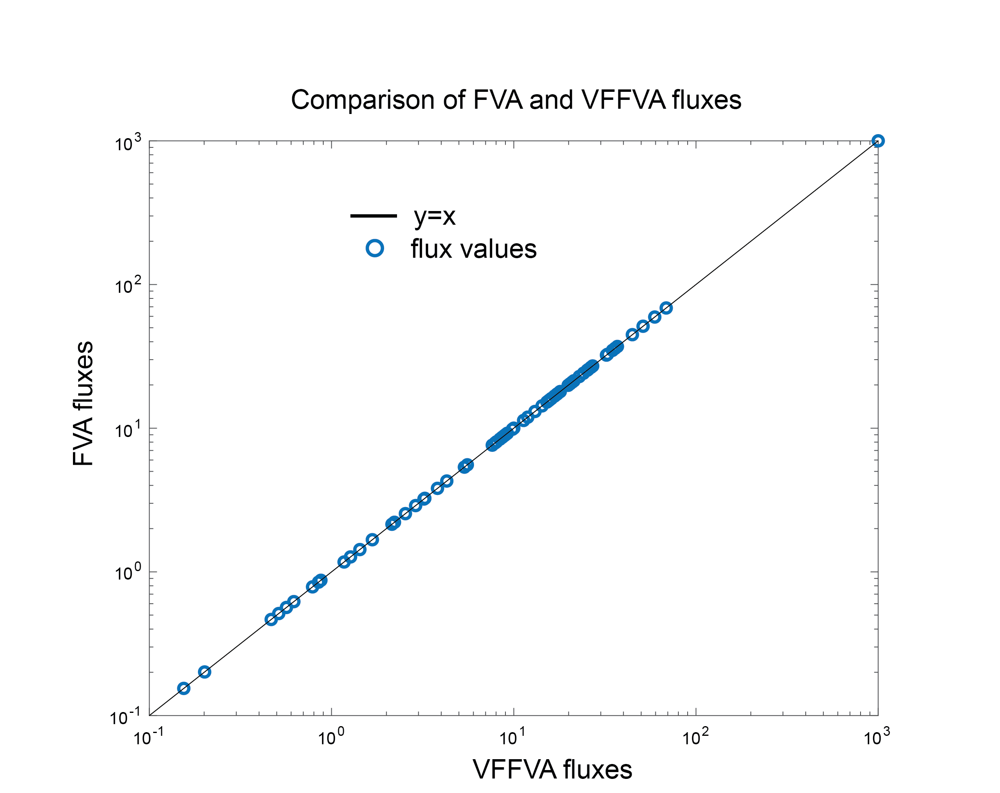

# Tutorials

First, make sure that VFFVA.m in MATLAB is correctly installed.

## Comparison of the results of FVA and VFFVA

In this tutorial, we would like to compare the consistency of the results between the COBRA Toolbox FVA function
and VFFVA.

+ Install the COBRA Toolbox through entering in your command prompt

```
git clone https://github.com/opencobra/cobratoolbox.git
```

+ Then launch MATLAB and add COBRA Toolbox to the path

```
addpath(genpath(\path\to\cobratoolbox))
```

+ Initiate the COBRA Toolbox

```
initCobraToolbox
```

+ Change the solver to IBM CPLEX

```
changeCobraSolver('ibm_cplex')
```

+ Run FVA on Ecoli core model

```
load ecoli_core_model.mat
ecoli=model;
optPercentage=90;
[minFluxFVA,maxFluxFVA]=fluxVariability(ecoli, optPercentage);
```

+ Run VFFVA on Ecoli core model

```
nCores=1;
nThreads=4;
load ecoli_core_model.mat
ecoli=model;
[minFluxVFFVA,maxFluxVFFVA]=VFFVA(nCores, nThreads, ecoli);
```

+ Compare the results

```
plot(minFluxVFFVA,minFluxFVA,'o')
hold on;
plot([-40 100],[-40 100])
```

As we can see the results lie perfectly on the identity line.

